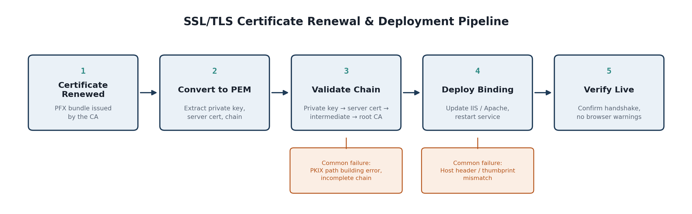

# SSL/TLS Certificate Lifecycle Management

A case study documenting how I manage the full SSL/TLS certificate lifecycle in production —
from a renewed certificate landing in my queue to a verified, browser-trusted deployment —
based on hands-on experience supporting a multi-server ERP platform in a technical support role.



> **Note:** This write-up generalizes real production work into a public-safe case study.
> Client names, hostnames, and environment-specific details have been removed or genericized.

---

## Background

Production environments I supported ran several components that each depend on their own
valid SSL/TLS certificate: an application server, an infrastructure server, an internal
gateway service, a content management service, and a database/reporting server. Certificates
across all of them expire on independent schedules, get reissued by different certificate
authorities, and sometimes need to move between formats depending on which service is
consuming them. Managing that lifecycle without causing an outage is the actual job.

---

## The Process

### **Step 1: Certificate Renewed**

A certificate authority (in my case, most often GoDaddy or Starfield) issues a renewed certificate as a **PFX bundle**.

**What you receive:**
- Email notification from your CA with download links
- A `.pfx` or `.p7b` file attached or available in your CA's management portal
- The password needed to open/decrypt the file (often in a separate email for security)

**Action items:**
- Download the PFX file to a secure location
- Store the password securely (never commit to version control)
- Note the expiration date for your records

---

### **Step 2: Convert PFX to PEM**

Web servers like IIS and Apache/Tomcat don't consume PFX directly in the way needed for validation, so the bundle must be converted to PEM format, carefully extracting the private key, server certificate, and intermediate certificates as separate components.

#### **Option A: Using OpenSSL (Linux/Mac/Windows with Git Bash)**

```bash
# Extract the private key (unencrypted)
openssl pkcs12 -in certificate.pfx -nocerts -out privatekey.key -nodes

# Extract the server certificate only
openssl pkcs12 -in certificate.pfx -clcerts -nokeys -out server-cert.pem

# Extract intermediate certificates
openssl pkcs12 -in certificate.pfx -cacerts -nokeys -out intermediate-ca.pem

# Verify extraction
openssl rsa -in privatekey.key -text -noout  # Should show RSA key details
openssl x509 -in server-cert.pem -text -noout  # Should show certificate details
```

#### **Option B: Using Windows Certificate Manager (GUI)**

1. **Press `Win + R`** and type `certmgr.msc` → Click **OK**
2. Navigate to **Personal > Certificates**
3. **Right-click** the imported certificate → **Export**
4. Choose **"No, do not export the private key"** for the server cert export
5. Select **DER encoded binary (.cer)** format
6. Repeat for intermediate certificates from **Intermediate Certification Authorities**
7. Use OpenSSL (as shown above) to convert `.cer` to `.pem`

**What you should have after conversion:**
```
privatekey.key          (RSA private key, ~3KB)
server-cert.pem         (Your domain certificate, ~2KB)
intermediate-ca.pem     (Chain of trust, ~1-3KB)
```

---

### **Step 3: Validate the Certificate Chain**

**Before anything touches production**, validate the complete trust chain — private key → server certificate → intermediate certificate(s) → root CA — checking for mismatches, expired intermediates, or an incomplete chain that would pass locally but fail in a real browser.

#### **Manual Validation Checklist**

```bash
# 1. Verify the private key matches the certificate
openssl x509 -noout -modulus -in server-cert.pem | openssl md5
openssl rsa -noout -modulus -in privatekey.key | openssl md5
# ✓ Both commands should return the SAME hash

# 2. Check certificate expiration
openssl x509 -noout -dates -in server-cert.pem
# Output example:
#   notBefore=Jan 15 00:00:00 2025 GMT
#   notAfter=Jan 15 23:59:59 2026 GMT

# 3. Verify the certificate chain
openssl verify -CAfile intermediate-ca.pem server-cert.pem
# ✓ Should output "server-cert.pem: OK"

# 4. Inspect individual certificates
openssl x509 -in server-cert.pem -text -noout | grep -A 2 "Subject:"
openssl x509 -in intermediate-ca.pem -text -noout | grep -A 2 "Issuer:"
```

**What to look for:**
- ✓ Private key modulus matches certificate modulus
- ✓ Certificate is valid today (notBefore < today < notAfter)
- ✓ Expiration date is at least 30 days away
- ✓ Subject CN matches your domain
- ✓ Chain validation passes with no errors

---

### **Step 4: Deploy the Binding**

Once validated, update the actual binding. The process differs significantly between IIS and Apache/Tomcat.

#### **IIS Deployment (Windows Server)**

**Prerequisites:** Admin access to IIS Manager, the `.pfx` file, and the password.

1. **Open IIS Manager**
   - Press `Win + R` → type `inetmgr` → **OK**
   - Or: **Server Manager > Tools > Internet Information Services (IIS) Manager**

2. **Import the Certificate into Windows Certificate Store**
   - Left panel: Click your **server name** (top-level node)
   - Center panel: Double-click **Server Certificates**
   - Right panel: Click **Import...**
   - Browse to your `.pfx` file and enter the password
   - Click **OK** → Certificate is now stored locally

3. **Bind the Certificate to a Website**
   - Left panel: Expand **Sites** → Select the target website
   - Right panel: Click **Bindings...**
   - Click **Add...** (or **Edit** if HTTPS already exists)
   - Select **Type: https**
   - **Port: 443** (or custom if needed)
   - **Host name:** Enter your domain (e.g., `example.com`)
   - **SSL certificate:** Drop-down → Select the newly imported certificate (look for your domain name)
   - Click **OK** → **Close**

4. **Verify the Thumbprint (Critical Step)**
   - Left panel: Right-click the website → **Edit Bindings**
   - Click the HTTPS binding → **Edit**
   - Note the **SSL certificate** shown (should match your domain)
   - If the wrong cert appears, click the dropdown and select the correct one
   - Compare the thumbprint in the dropdown with the cert details you verified in Step 3

5. **Restart the Website**
   - Right-click the website in the left panel → **Restart**
   - Check the **Application Pools** section and restart associated pools if needed

---

#### **Apache/Tomcat Deployment (Linux/Unix)**

**Prerequisites:** `sudo` or root access, the `.key`, `.pem`, and intermediate files.

**For Apache:**

1. **Copy Certificate Files to Apache Directory**
   ```bash
   sudo cp privatekey.key /etc/apache2/ssl/
   sudo cp server-cert.pem /etc/apache2/ssl/
   sudo cp intermediate-ca.pem /etc/apache2/ssl/
   sudo chmod 600 /etc/apache2/ssl/privatekey.key  # Private key must be read-only
   ```

2. **Enable SSL Module**
   ```bash
   sudo a2enmod ssl
   sudo a2enmod rewrite  # Often needed for HTTP → HTTPS redirect
   ```

3. **Edit the Virtual Host Configuration**
   - Open `/etc/apache2/sites-available/default-ssl.conf` (or your site config)
   - Find or add these lines:
   ```apache
   <VirtualHost *:443>
       ServerName example.com
       
       # SSL Directives
       SSLEngine on
       SSLCertificateFile /etc/apache2/ssl/server-cert.pem
       SSLCertificateKeyFile /etc/apache2/ssl/privatekey.key
       SSLCertificateChainFile /etc/apache2/ssl/intermediate-ca.pem
       
       # Other config...
   </VirtualHost>
   ```

4. **Test Configuration**
   ```bash
   sudo apache2ctl configtest
   # Output should be: "Syntax OK"
   ```

5. **Restart Apache**
   ```bash
   sudo systemctl restart apache2
   # Or: sudo service apache2 restart
   ```

**For Tomcat:**

1. **Convert PEM to PKCS12 (Tomcat Native Format)**
   ```bash
   openssl pkcs12 -export \
       -in server-cert.pem \
       -inkey privatekey.key \
       -certfile intermediate-ca.pem \
       -out tomcat-keystore.p12 \
       -name tomcat \
       -passout pass:YOUR_KEYSTORE_PASSWORD
   ```

2. **Copy to Tomcat Directory**
   ```bash
   sudo cp tomcat-keystore.p12 /path/to/tomcat/conf/
   sudo chown tomcat:tomcat /path/to/tomcat/conf/tomcat-keystore.p12
   sudo chmod 600 /path/to/tomcat/conf/tomcat-keystore.p12
   ```

3. **Edit Tomcat Configuration**
   - Open `/path/to/tomcat/conf/server.xml`
   - Find the `<Connector port="8443"...>` section
   - Update or add:
   ```xml
   <Connector port="8443" 
              protocol="HTTP/1.1"
              SSLEnabled="true"
              scheme="https"
              secure="true"
              keystoreFile="conf/tomcat-keystore.p12"
              keystorePass="YOUR_KEYSTORE_PASSWORD"
              keystoreType="PKCS12" />
   ```

4. **Restart Tomcat**
   ```bash
   sudo /path/to/tomcat/bin/shutdown.sh
   sudo /path/to/tomcat/bin/startup.sh
   # Or: sudo systemctl restart tomcat
   ```

---

### **Step 5: Verify Live**

Final step is confirming a clean handshake with no browser trust warnings and no regressions on dependent services.

#### **Browser Verification**

1. **Open the Website**
   - Visit `https://your-domain.com` in a modern browser
   - Look for the **green lock icon** in the address bar (Firefox/Chrome)
   - Click the lock → **Connection Secure** should appear

2. **Inspect Certificate Details**
   - Click **Connection is secure** → **Certificate is valid** → **Show more** → **Details**
   - Verify:
     - ✓ Subject CN matches your domain
     - ✓ Issuer matches your Certificate Authority
     - ✓ Expiration date is correct
     - ✓ **No red warnings or expired status**

#### **Command-Line Verification**

```bash
# View the live certificate served by your server
openssl s_client -connect example.com:443 -showcerts

# Output should show:
# - "Verify return code: 0 (ok)" ✓
# - The certificate chain in order
# - No warnings about self-signed or untrusted certificates

# Quick expiration check
openssl s_client -connect example.com:443 -showcerts | openssl x509 -noout -dates
```

#### **Online SSL Checker Tools**

- **[SSL Labs (Qualys)](https://www.ssllabs.com/ssltest/)** — Comprehensive scan
- **[Digicert Certificate Checker](https://www.digicert.com/help/certificate-validator)**
- **[Let's Encrypt Certificate Check](https://crt.sh/)** — Certificate transparency lookup

**What to check for:**
- ✓ **Grade A or better** on SSL Labs
- ✓ **Certificate chain is complete** and valid
- ✓ **No mixed content warnings** (HTTPS page loading HTTP resources)
- ✓ **No browser compatibility issues** for your target browsers

---

## Common Failure Modes & How I Diagnosed Them

| Failure | What it looks like | Root cause | How to fix |
|---|---|---|---|
| **PKIX path building error** | TLS handshake fails post-renewal even though the cert "looks" valid | Intermediate certificate missing or installed in the wrong store | Ensure `SSLCertificateChainFile` (Apache) or intermediate import (IIS) is correct |
| **KeyUsage incompatibility** | Certificate is trusted but rejected for the specific service using it | Certificate issued with extensions that don't match how the service uses it | Contact CA; may need to reissue with correct extensions |
| **Incomplete chain** | Works in some browsers/tools, fails in others | Root or intermediate CA not included in the deployed bundle | Bundle all intermediates; test with `openssl verify` |
| **Host header / thumbprint mismatch** | Deployment completes but the wrong certificate is served | Binding updated with the correct thumbprint but wrong host header, or vice versa | Verify thumbprint matches and host name is correct in IIS bindings |
| **Private key permission denied** | Apache/Tomcat won't start; `Permission denied` in logs | Private key file not readable by the web server user | Run `sudo chmod 600` and ensure web server user owns the file |
| **Certificate not yet valid** | Browser shows "not yet valid" or "future date" error | System clock on server is wrong | Check server time: `date` (Linux) or System Settings (Windows); sync if needed |

Diagnosing these reliably comes down to validating the chain manually (I used tools like
OpenSSL and a plain text editor to inspect each certificate in the bundle) rather than trusting
that "renewed" means "correctly configured."

---

## Skills Demonstrated

`SSL/TLS` `PFX → PEM Conversion` `Certificate Chain Validation` `IIS` `Apache / Tomcat`
`Windows Server` `Root & Intermediate CA Management` `Production Troubleshooting`
`OpenSSL` `Certificate Pinning & Verification` `Multi-Server Certificate Management`

---

## Additional Resources

### Tools Used
- **OpenSSL** — Certificate inspection and conversion (Linux/Mac/Windows Git Bash)
- **IIS Manager** — Windows Server certificate binding
- **Apache2ctl** — Apache configuration testing
- **Tomcat Server.xml** — Java application server configuration
- **SSL Labs / Digicert** — Live certificate validation

### References
- [OpenSSL Certificate Conversion Guide](https://www.ssl.com/article/how-to-convert-pfx-to-pem/)
- [IIS SSL Certificate Binding (Microsoft)](https://docs.microsoft.com/en-us/iis/manage/configuring-security/configuring-ssl-in-iis)
- [Apache mod_ssl Documentation](https://httpd.apache.org/docs/2.4/mod/mod_ssl.html)
- [Tomcat SSL/TLS Configuration](https://tomcat.apache.org/tomcat-9.0-doc/ssl-howto.html)

---

*Part of my [technical support & deployment operations portfolio](https://github.com/Charmarke1/charmarke1).*
